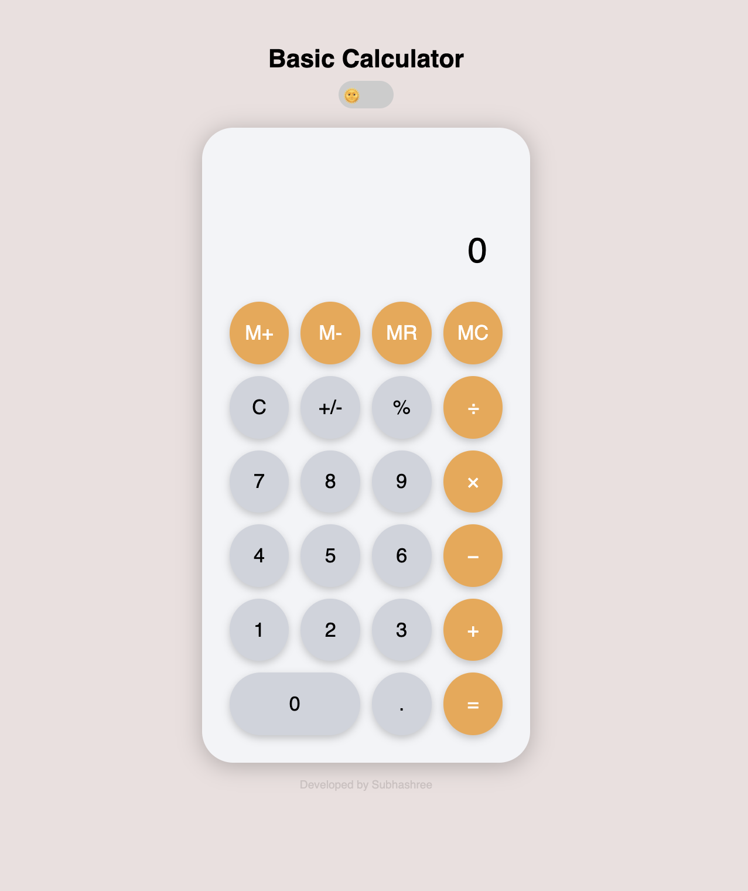
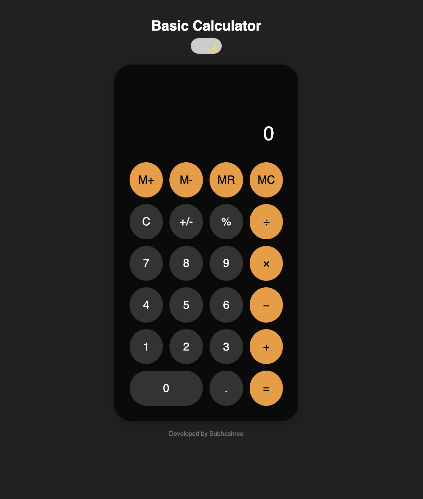

# 🧮 Basic Calculator

A sleek and responsive **Basic Calculator** built using **HTML, CSS, and JavaScript**, featuring a glass–effect UI, light/dark themes, memory functions, and keyboard support.

---

## ✨ Features

✅ **Basic Operations** — Addition, subtraction, multiplication, and division.  
✅ **Advanced Features** — Percentage (%), sign toggle (±), and decimal support.  
✅ **Memory Functions**  
- 🧠 **M+** → Add to memory  
- ➖ **M-** → Subtract from memory  
- 📋 **MR** → Recall memory  
- ❌ **MC** → Clear memory  
✅ **Light / Dark Theme** — Smooth theme toggle 🌞🌙 saved in localStorage.  
✅ **Keyboard Support** — Perform calculations directly from your keyboard.  
✅ **Recent History** — Displays your latest calculations.  
✅ **Glass-Effect Buttons** — Aesthetic translucent button design.  
✅ **Responsive Layout** — Works seamlessly on desktop, tablet, and mobile.

---

## 🛠️ Tech Stack

| Technology | Purpose |
|-------------|----------|
| ⚙️ **HTML5** | Structure and layout |
| 🎨 **CSS3** | Styling, responsiveness, and glassmorphism |
| 🧩 **JavaScript (ES6)** | Core calculator logic and theme handling |

---
## 💻 Preview

  
  

